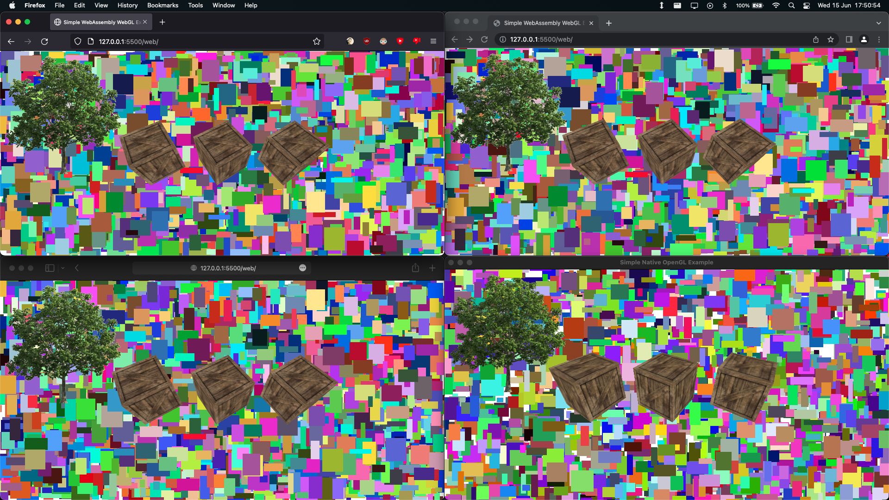

# Portable (Web & Desktop) OpenGL Example
A simple portable OpenGL application that can run in the browser with WebAssembly and WebGL 2 (OpenGL ES 3.0) and in a native desktop window with OpenGL 3.3 Core and the GLFW3 library

You need the [LLVM toolchain](https://llvm.org/) to run the `build.sh` script, you also need the [GLFW3](https://www.glfw.org/) library to build the native desktop application. It is very usefull to use the [WebAssembly Binary Toolkit](https://github.com/WebAssembly/wabt) tools to disassamble and inspect your wasm bundles.

## Screenshot

*A screenshot of the program running in Firefox, Chrome, Safari and a native desktop window*
