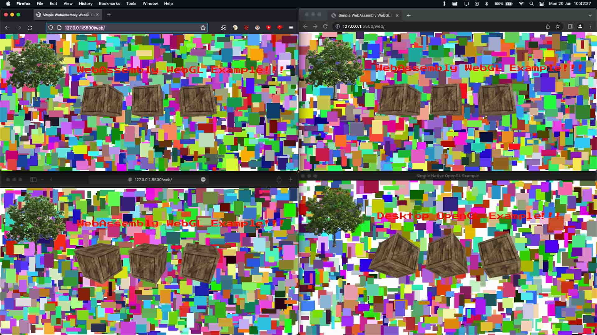
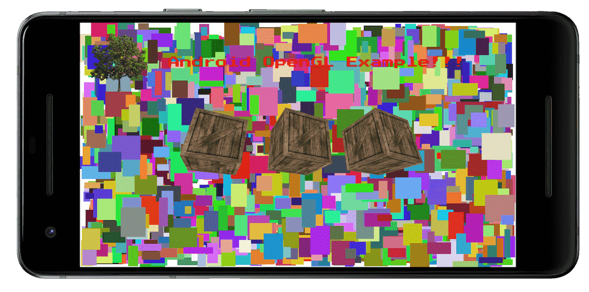

# Portable (Android, Desktop & Web) OpenGL Example
A simple portable OpenGL application that can run in a native Android app with OpenGL ES 3.0, in a native desktop window with OpenGL 3.3 Core and in a browser with WebAssembly and WebGL 2

## Android dependencies
You need the [Android SDK](https://developer.android.com/studio/#command-tools) and the [Android NDK](https://developer.android.com/ndk/downloads/), it must be installed some where on your system and the `$ANDROID_HOME` and `$ANDROID_NDK_ROOT` variables must be set before you run the `build.sh android` build script.

## Desktop dependencies
You need the [LLVM toolchain](https://llvm.org/) or a [GCC compiler environment](https://gcc.gnu.org/) to run the `build.sh desktop` build script, you also need the [GLFW3](https://www.glfw.org/). The rest of the dependencies are included in this repo and automatically build with the application.

## Web dependencies
You need the [LLVM toolchain](https://llvm.org/) to run the `build.sh web` script. It is very usefull to use the [WebAssembly Binary Toolkit](https://github.com/WebAssembly/wabt) tools to disassamble and inspect your wasm bundles.

## Screenshots

*A screenshot of the program running in Firefox, Chrome, Safari and a native desktop window*

*A screenshot of the program running in a Android emulator as a native app*
